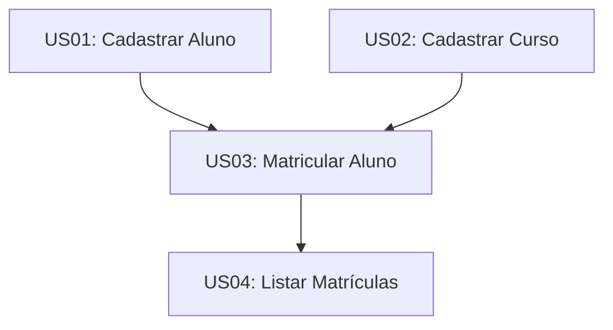

# Histórias de Usuário - Sistema de Gestão de Matrículas

Este documento contém o planejamento de desenvolvimento do sistema com base nas estórias iniciais fornecidas pelo cliente (Planning Game do Extreme Programming).

---

## 📋 Estórias de Usuário e Estimativas

Para estimar a complexidade das estórias, nossa equipe utilizou a **Sequência de Fibonacci** (1, 2, 3, 5, 8), avaliando o esforço de codificação, testes e potenciais riscos.

### [US01] Cadastrar Aluno
- **Como** atendente,
- **Quero** cadastrar um aluno,
- **Para** manter seus dados no sistema.
- **Critérios de Aceitação:**
  - Informar nome e e-mail.
  - O registro deve ficar armazenado em memória.
  - Não permitir cadastrar aluno com nome vazio ou nulo.
- **Estimativa de Complexidade:** `2` (Baixa complexidade, validação direta).

### [US02] Cadastrar Curso
- **Como** atendente,
- **Quero** cadastrar um curso,
- **Para** disponibilizá-lo para matrícula.
- **Critérios de Aceitação:**
  - Informar nome do curso e quantidade de vagas totais.
  - O registro deve ficar armazenado em memória.
  - Garantir que a quantidade de vagas seja maior que 0 (vagas > 0).
- **Estimativa de Complexidade:** `2` (Baixa complexidade, validação direta).

### [US03] Matricular Aluno em Curso
- **Como** atendente,
- **Quero** matricular um aluno em um curso,
- **Para** registrar sua inscrição.
- **Critérios de Aceitação:**
  - Aluno e curso devem já estar previamente cadastrados no sistema.
  - A matrícula deve ser registrada e associar o aluno ao curso.
  - Impedir duplicidade (o mesmo aluno não pode se matricular no mesmo curso mais de uma vez).
  - Verificar a disponibilidade de vagas (impedir a matrícula se as vagas do curso estiverem esgotadas).
  - Decrementar as vagas disponíveis do curso ao confirmar a matrícula.
- **Estimativa de Complexidade:** `5` (Média-alta complexidade. Envolve regras de negócio cruzadas, validação de estado e concorrência lógica de vagas).

### [US04] Listar Matrículas
- **Como** atendente,
- **Quero** listar todas as matrículas,
- **Para** acompanhar os registros realizados.
- **Critérios de Aceitação:**
  - Exibir a relação de cada aluno matriculado com seu respectivo curso.
  - Mostrar todas as matrículas ativas feitas no sistema.
- **Estimativa de Complexidade:** `3` (Média complexidade. Envolve formatação, leitura segura de dados e apresentação limpa via CLI).

---

## 🎯 Priorização e Ordem de Dependência (1ª Iteração)

Seguindo a regra de dependência lógica do Extreme Programming, todas as estórias serão implementadas nesta iteração, seguindo a ordem de pipeline abaixo:

1. **`US01` (Cadastrar Aluno) & `US02` (Cadastrar Curso):** Devem ser desenvolvidas primeiro, pois são as entidades base. Sem Alunos e Cursos cadastrados, não é possível matricular ninguém.
2. **`US03` (Matricular Aluno):** Desenvolvida em seguida. Contém o núcleo da regra de negócio da escola e as principais validações.
3. **`US04` (Listar Matrículas):** Desenvolvida por último, permitindo verificar e auditar os registros feitos pela `US03`.
